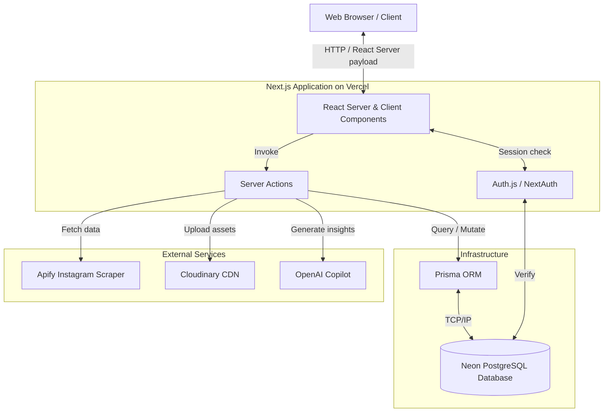
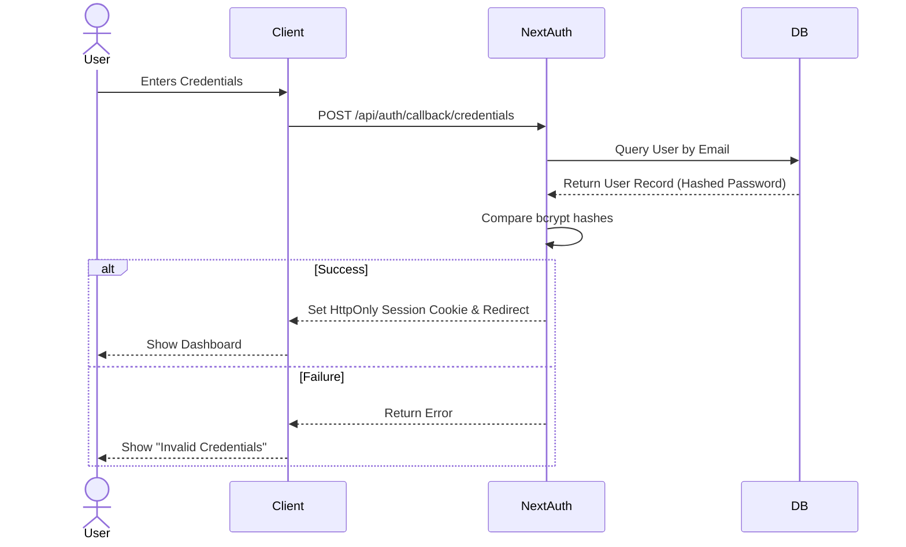
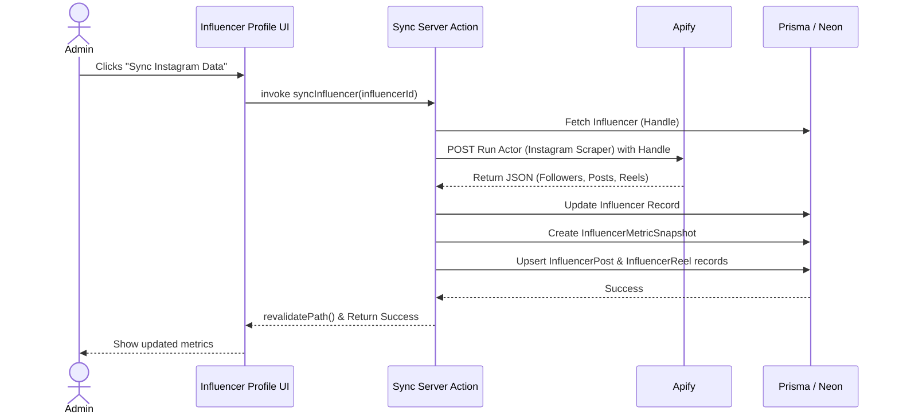
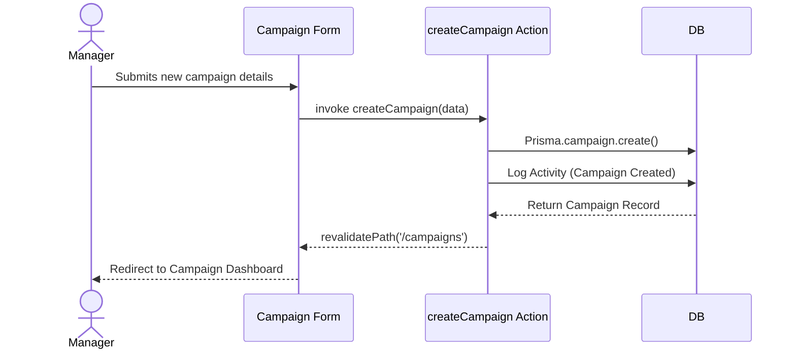

# Architecture Documentation

TwinPix Workspace is built using a modern, server-first architecture powered by the Next.js App Router. This document provides a high-level overview of the system, data flows, and external integrations.

---

## High-Level Architecture Diagram

---

## Core Technologies Explained

### Next.js App Router
We utilize the Next.js App Router (`/src/app`) to heavily leverage React Server Components (RSC). By default, components render on the server, resulting in smaller client bundles and faster Initial Page Loads. Client Components (`"use client"`) are used strictly at the leaves of the component tree for interactivity, state management (Zustand), and animations (Framer Motion).

### Server Actions
Instead of traditional REST APIs (`/api/route`), all data mutations (Creates, Updates, Deletes) are handled via **Server Actions** located in `/src/actions`. These provide end-to-end type safety and direct integration with React's `useTransition` and `<form action={...}>`.

### Prisma & PostgreSQL
Our database is hosted on **Neon**, providing serverless PostgreSQL. **Prisma** acts as our Type-Safe ORM. The schema (`prisma/schema.prisma`) acts as the single source of truth for our data models, generating precise TypeScript definitions used throughout the application.

### Authentication Flow (Auth.js)
We use `NextAuth.js` (Auth.js) with the Prisma Adapter. Authentication is currently handled via credentials (bcrypt hashed passwords). Sessions are managed securely via encrypted JWTs stored in HTTP-only cookies.

---

## Sequence Diagrams

### 1. User Login Flow

### 2. Influencer Sync Flow (Apify Integration)

### 3. Campaign Creation Flow

---

## Caching Strategy
Next.js aggressively caches fetch requests and pages. We invalidate caches on mutation by calling `revalidatePath('/path')` within our Server Actions. This ensures the user immediately sees updated data (e.g., after updating task status) without requiring a full page refresh.
