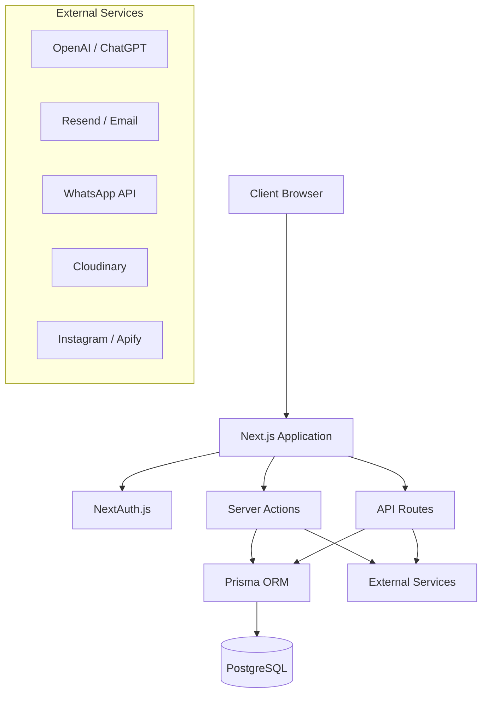
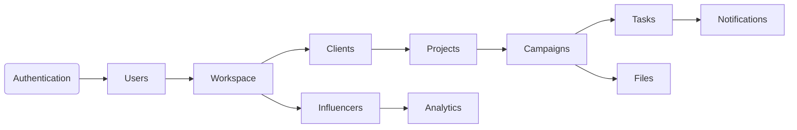
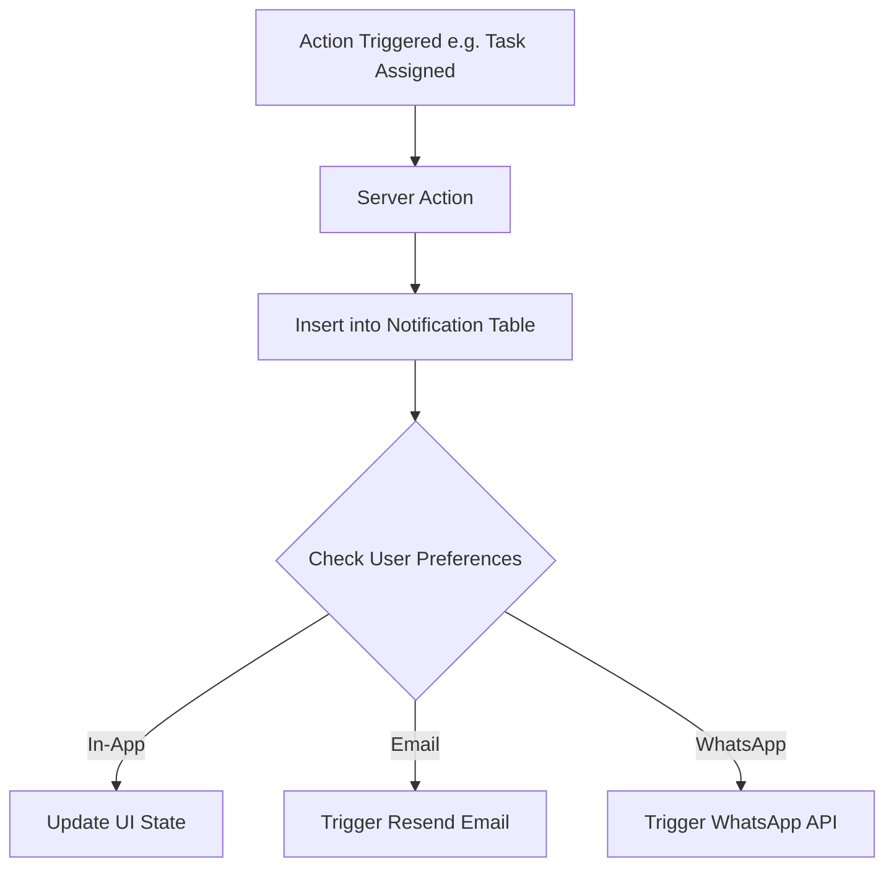
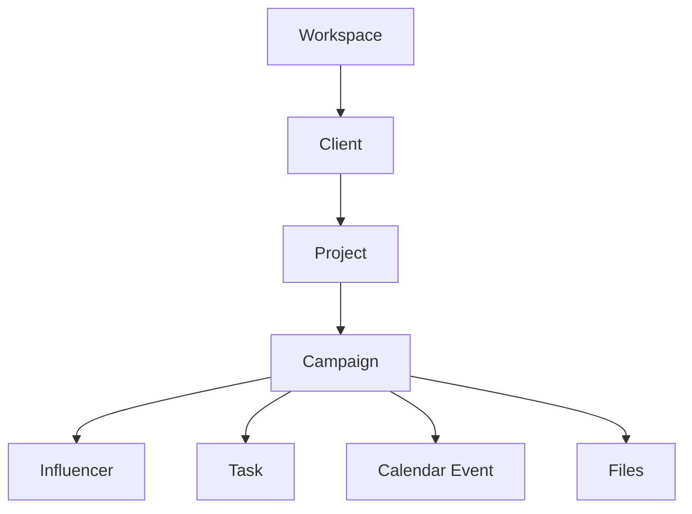

# System Architecture

TwinPix Workspace utilizes a modern, serverless-first architecture built on Next.js, optimizing for both developer experience and performance.

## High-Level Architecture

```mermaid
graph TD
    Client[Client Browser] --> NextJS[Next.js Application]
    NextJS --> Auth[NextAuth.js]
    NextJS --> ServerActions[Server Actions]
    NextJS --> APIRoutes[API Routes]
    
    ServerActions --> Prisma[Prisma ORM]
    APIRoutes --> Prisma
    
    Prisma --> Postgres[(PostgreSQL)]
    
    ServerActions --> External[External Services]
    APIRoutes --> External
    
    subgraph External Services
        OpenAI[OpenAI / ChatGPT]
        Resend[Resend / Email]
        WhatsApp[WhatsApp API]
        Cloudinary[Cloudinary]
        Instagram[Instagram / Apify]
    end
```

## Folder Architecture

The codebase follows a modular structure organized by technical concern and domain logic:

- **`src/app`**: Contains the routing layer. Divided into Route Groups `(auth)` for unauthenticated pages and `(dashboard)` for the main application.
- **`src/actions`**: Server Actions. This is the primary mutation layer. React components call these actions directly without hitting traditional API routes.
- **`src/app/api`**: Reserved for webhooks, cron jobs, and external integrations that cannot use Server Actions (e.g., OAuth callbacks, Apify webhooks).
- **`src/components`**: Highly modular UI components. Split between basic UI elements (`shadcn/ui`) and complex feature-specific components.
- **`src/lib`**: Core utilities, including the initialized Prisma client (`lib/prisma.ts`) and AI utility functions.

## Module Relationships

```mermaid
graph LR
    Auth(Authentication) --> Users
    Users --> Workspace
    Workspace --> Clients
    Workspace --> Influencers
    Clients --> Projects
    Projects --> Campaigns
    Campaigns --> Tasks
    Campaigns --> Files
    Influencers --> Analytics
    Tasks --> Notifications
```

## Database Relationships

The database is heavily normalized. Key relationships include:
- A **User** can have multiple roles and manage multiple **Influencers** and **Tasks**.
- A **Client** has multiple **Projects** and **Campaigns**.
- A **Campaign** involves multiple **Influencers** (via a join table) and **Team Members**.
- A **Task** is assigned to a **User**, authored by a **User**, and belongs to a **Campaign** or **Project**.

## Authentication Flow

1. User attempts to access a protected route in `(dashboard)`.
2. Next.js Middleware intercepts the request.
3. If unauthenticated, the user is redirected to `/login`.
4. Authentication is handled via NextAuth.js using Credentials (bcrypt hashed) or OAuth.
5. The session is stored securely, and role-based access control (RBAC) determines what UI elements are rendered.

## Notification Flow

```mermaid
graph TD
    Trigger[Action Triggered e.g. Task Assigned] --> Action[Server Action]
    Action --> DBInsert[Insert into Notification Table]
    DBInsert --> PrefCheck{Check User Preferences}
    PrefCheck -->|In-App| UI[Update UI State]
    PrefCheck -->|Email| Resend[Trigger Resend Email]
    PrefCheck -->|WhatsApp| WA[Trigger WhatsApp API]
```

## AI Flow

TwinPix deeply integrates OpenAI for creator intelligence.
1. System pulls influencer data (from DB or Instagram).
2. Data is formatted into a prompt within `src/lib/ai` or `src/app/api/copilot`.
3. OpenAI returns structured JSON.
4. Insights (Strengths, Brand Safety, Match Score) are stored in `CreatorAIInsights` and `BrandMatchAnalysis` tables.

## Instagram Sync Flow

1. Cron job triggers `src/app/api/instagram/sync`.
2. System queries the Apify API to scrape latest Instagram data for active influencers.
3. Apify webhook posts data back to our API.
4. Data is parsed and upserted into `InfluencerPost`, `InfluencerReel`, and `InfluencerMetricSnapshot` tables.

## Project Hierarchy

```mermaid
graph TD
    A[Workspace] --> B[Client]
    B --> C[Project]
    C --> D[Campaign]
    D --> E[Influencer]
    D --> F[Task]
    D --> G[Calendar Event]
    D --> H[Files]
```
