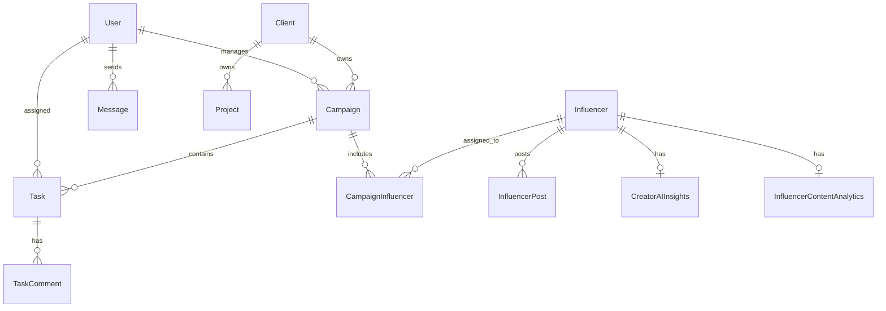

# Database Schema

TwinPix Workspace uses **PostgreSQL** as the primary database, managed via the **Prisma ORM**. The schema is optimized for a multi-tenant-like CRM structure, heavy relational linking, and fast analytical queries.

## ER Diagram (Core Entities)

---

## Model Reference

### 1. `User`
**Purpose**: Represents staff, admins, and team members who log into the TwinPix Workspace.
**Key Fields**:
- `id` (cuid)
- `email` (String, unique)
- `password` (String, hashed)
- `role` (Enum: SUPER_ADMIN, ADMIN, TEAM_MEMBER, CLIENT)
**Relationships**: Authors tasks, receives assigned tasks, manages campaigns, sends messages.

### 2. `Influencer`
**Purpose**: The core CRM entity. Represents a creator tracked by the agency.
**Key Fields**:
- `instagramHandle` (String, unique)
- `status` (Enum: NEW_LEAD, CONTACTED, ACTIVE, ONBOARDED)
- `followers` (Int)
- `engagementRate` (Float)
**Relationships**: Links to `CampaignInfluencer` (join table for campaigns), `InfluencerPost` (scraped data), `CreatorAIInsights` (AI analysis).

### 3. `Client`
**Purpose**: Represents external brands or agencies that TwinPix works with.
**Key Fields**:
- `companyName` (String)
- `status` (Enum: LEAD, ACTIVE, CLOSED)
**Relationships**: Has many `Campaign`s and `Project`s. Has many `ClientNote`s for CRM history.

### 4. `Campaign`
**Purpose**: A specific marketing initiative involving multiple influencers and tasks.
**Key Fields**:
- `name` (String)
- `budget` (Float)
- `status` (Enum: PLANNING, ACTIVE, REVIEW, COMPLETED)
**Relationships**: Belongs to a `Client`. Has many `Task`s. Links to Influencers via `CampaignInfluencer`.

### 5. `Task`
**Purpose**: Kanban board tasks for workspace collaboration.
**Key Fields**:
- `title` (String)
- `status` (Enum: TODO, IN_PROGRESS, REVIEW, DONE)
- `priority` (Enum: LOW, MEDIUM, HIGH, URGENT)
**Relationships**: Authored by a `User`, Assigned to a `User`, optionally linked to a `Campaign`.

### 6. `CreatorAIInsights`
**Purpose**: Stores OpenAI-generated SWOT analyses and brand safety scores for creators.
**Key Fields**:
- `influencerId` (String, unique)
- `brandSafetyScore` (Enum: LOW, MEDIUM, HIGH)
- `collaborationRecommendation` (Enum)
- `strengths` (String[])

### 7. `Message`
**Purpose**: Internal team messaging system.
**Key Fields**:
- `senderId` (String)
- `receiverId` (String)
- `content` (String)
- `isRead` (Boolean)

### Indexes
Extensive indexing is applied on foreign keys (`clientId`, `campaignId`, `influencerId`) and frequently filtered fields (`status`, `role`, `email`, `instagramHandle`) to ensure sub-millisecond query times on Neon Postgres.
