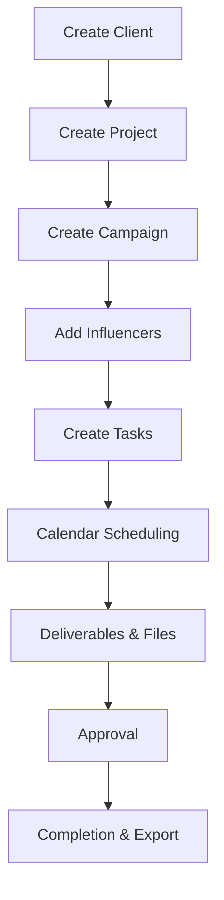

# Major Workflows

This document outlines the standard operating procedures and data workflows within TwinPix Workspace.

## The Core Agency Lifecycle

The typical flow for an influencer marketing campaign moves hierarchically through the system:

### 1. Create Client
The CRM journey begins by creating a `Client` profile. This centralizes company details, tags, and internal notes.

### 2. Create Project
For clients with ongoing retainers, a `Project` is created as an umbrella container to hold multiple distinct marketing pushes.

### 3. Create Campaign
A `Campaign` is initialized under the Client/Project. This dictates the budget, timeline, and overall expected deliverables.

### 4. Add Influencers
Users query the Influencer CRM to find matches. They then link `Influencers` to the `Campaign` (creating a `CampaignInfluencer` join record), defining specific fees and individual deliverables for that creator.

### 5. Create Tasks
The project manager breaks the campaign down into actionable `Tasks` (e.g., "Draft Brief", "Negotiate Rates"), assigns them to team members, sets priorities, and establishes due dates.

### 6. Calendar
Due dates from Tasks and start/end dates from Campaigns automatically populate the unified `Calendar`. Specialized events (e.g., `CAMPAIGN_LAUNCH`, `INSTAGRAM_REEL` posting) are tracked here.

### 7. Deliverables (Files)
As work progresses, assets (contracts, drafts, final videos) are uploaded. The `File` model links these assets directly to the relevant Task, Campaign, or Influencer.

### 8. Approval & Completion
Status changes flow upwards. Tasks are moved to `REVIEW` then `DONE`. Once all tasks are complete and deliverables approved, the Campaign status is updated to `COMPLETED`.

### 9. Exports & Analytics
The team leverages the Analytics Dashboard to review performance and uses the Export feature to generate a PDF/CSV summary for the client.
